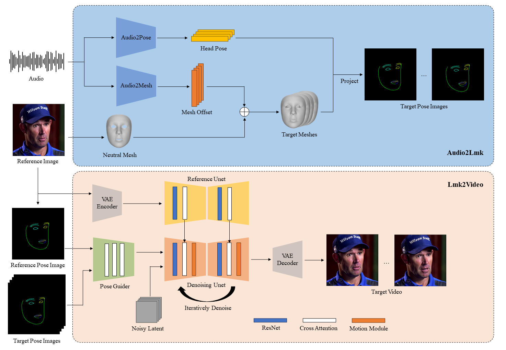

# AniPortrait

**AniPortrait: Audio-Driven Synthesis of Photorealistic Portrait Animations**

Author: Huawei Wei, Zejun Yang, Zhisheng Wang

Organization: Tencent Games Zhiji, Tencent


Here we propose AniPortrait, a novel framework for generating high-quality animation driven by 
audio and a reference portrait image. You can also provide a video to achieve face reenacment.

<a href='https://arxiv.org/abs/2403.17694'></a>

## Pipeline



## TODO List

- [x] Now our paper is available on arXiv.

- [x] Update the code to generate pose_temp.npy for head pose control.

- [ ] We will release audio2pose pre-trained weight for audio2video after futher optimization. You can choose head pose template in `./configs/inference/head_pose_temp` as substitution.

## Various Generated Videos

### Self driven

<table class="center">
<tr>
    <td width=50% style="border: none">
        <video controls autoplay loop src="https://github.com/Zejun-Yang/AniPortrait/assets/21038147/82c0f0b0-9c7c-4aad-bf0e-27e6098ffbe1" muted="false"></video>
    </td>
    <td width=50% style="border: none">
        <video controls autoplay loop src="https://github.com/Zejun-Yang/AniPortrait/assets/21038147/51a502d9-1ce2-48d2-afbe-767a0b9b9166" muted="false"></video>
    </td>
</tr>
</table>

### Face reenacment

<table class="center">
<tr>
    <td width=50% style="border: none">
        <video controls autoplay loop src="https://github.com/Zejun-Yang/AniPortrait/assets/21038147/849fce22-0db1-4257-a75f-a5dc655e6b9e" muted="false"></video>
    </td>
    <td width=50% style="border: none">
        <video controls autoplay loop src="https://github.com/Zejun-Yang/AniPortrait/assets/21038147/d4e0add6-20a2-4f4b-808c-530a6f4d3331" muted="false"></video>
    </td>
</tr>
</table>

### Audio driven

<table class="center">
<tr>
    <td width=50% style="border: none">
        <video controls autoplay loop src="https://github.com/Zejun-Yang/AniPortrait/assets/21038147/63171e5a-e4c1-4383-8f20-9764524928d0" muted="false"></video>
    </td>
    <td width=50% style="border: none">
        <video controls autoplay loop src="https://github.com/Zejun-Yang/AniPortrait/assets/21038147/6fd74024-ba19-4f6b-b37a-10df5cf2c934" muted="false"></video>
    </td>
</tr>

<tr>
    <td width=50% style="border: none">
        <video controls autoplay loop src="https://github.com/Zejun-Yang/AniPortrait/assets/21038147/9e516cc5-bf09-4d45-b5e3-820030764982" muted="false"></video>
    </td>
    <td width=50% style="border: none">
        <video controls autoplay loop src="https://github.com/Zejun-Yang/AniPortrait/assets/21038147/7c68148b-8022-453f-be9a-c69590038197" muted="false"></video>
    </td>
</tr>
</table>

## Installation

### Build environment

We recommend a python version >=3.10 and cuda version =11.7. Then build environment as follows:

```shell
pip install -r requirements.txt
```

### Download weights

All the weights should be placed under the `./pretrained_weights` direcotry. You can download weights manually as follows:

1. Download our trained [weights](https://huggingface.co/ZJYang/AniPortrait/tree/main), which include four parts: `denoising_unet.pth`, `reference_unet.pth`, `pose_guider.pth`, `motion_module.pth` and `audio2mesh.pt`.

2. Download pretrained weight of based models and other components: 
    - [StableDiffusion V1.5](https://huggingface.co/runwayml/stable-diffusion-v1-5)
    - [sd-vae-ft-mse](https://huggingface.co/stabilityai/sd-vae-ft-mse)
    - [image_encoder](https://huggingface.co/lambdalabs/sd-image-variations-diffusers/tree/main/image_encoder)
    - [wav2vec2-base-960h](https://huggingface.co/facebook/wav2vec2-base-960h)

Finally, these weights should be orgnized as follows:

```text
./pretrained_weights/
|-- image_encoder
|   |-- config.json
|   `-- pytorch_model.bin
|-- sd-vae-ft-mse
|   |-- config.json
|   |-- diffusion_pytorch_model.bin
|   `-- diffusion_pytorch_model.safetensors
|-- stable-diffusion-v1-5
|   |-- feature_extractor
|   |   `-- preprocessor_config.json
|   |-- model_index.json
|   |-- unet
|   |   |-- config.json
|   |   `-- diffusion_pytorch_model.bin
|   `-- v1-inference.yaml
|-- wav2vec2-base-960h
|   |-- config.json
|   |-- feature_extractor_config.json
|   |-- preprocessor_config.json
|   |-- pytorch_model.bin
|   |-- README.md
|   |-- special_tokens_map.json
|   |-- tokenizer_config.json
|   `-- vocab.json
|-- audio2mesh.pt
|-- denoising_unet.pth
|-- motion_module.pth
|-- pose_guider.pth
`-- reference_unet.pth
```

Note: If you have installed some of the pretrained models, such as `StableDiffusion V1.5`, you can specify their paths in the config file (e.g. `./config/prompts/animation.yaml`).

## Inference

Here are the cli commands for running inference scripts:

**Kindly note that you can set -L to the desired number of generating frames in the command, for example, -L 300.**

### Self driven

```shell
python -m scripts.pose2vid --config ./configs/prompts/animation.yaml -W 512 -H 512
```

You can refer the format of animation.yaml to add your own reference images or pose videos. To convert the raw video into a pose video (keypoint sequence), you can run with the following command:

```shell
python -m scripts.vid2pose --video_path pose_video_path.mp4
```

### Face reenacment

```shell
python -m scripts.vid2vid --config ./configs/prompts/animation_facereenac.yaml -W 512 -H 512
```

Add source face videos and reference images in the animation_facereenac.yaml.

### Audio driven

```shell
python -m scripts.audio2vid --config ./configs/prompts/animation_audio.yaml -W 512 -H 512
```

Add audios and reference images in the animation_audio.yaml.

You can use this command to generate a pose_temp.npy for head pose control:

```shell
python -m scripts.generate_ref_pose --ref_video ./configs/inference/head_pose_temp/pose_ref_video.mp4 --save_path ./configs/inference/head_pose_temp/pose.npy
```

## Training

### Data preparation
Download [VFHQ](https://liangbinxie.github.io/projects/vfhq/) and [CelebV-HQ](https://github.com/CelebV-HQ/CelebV-HQ) 

Extract keypoints from raw videos and write training json file (here is an example of processing VFHQ): 

```shell
python -m scripts.preprocess_dataset --input_dir VFHQ_PATH --output_dir SAVE_PATH --training_json JSON_PATH
```

Update lines in the training config file: 

```yaml
data:
  json_path: JSON_PATH
```

### Stage1

Run command:

```shell
accelerate launch train_stage_1.py --config ./configs/train/stage1.yaml
```

### Stage2

Put the pretrained motion module weights `mm_sd_v15_v2.ckpt` ([download link](https://huggingface.co/guoyww/animatediff/blob/main/mm_sd_v15_v2.ckpt)) under `./pretrained_weights`. 

Specify the stage1 training weights in the config file `stage2.yaml`, for example:

```yaml
stage1_ckpt_dir: './exp_output/stage1'
stage1_ckpt_step: 30000 
```

Run command:

```shell
accelerate launch train_stage_2.py --config ./configs/train/stage2.yaml
```

## Acknowledgements

We first thank the authors of [EMO](https://github.com/HumanAIGC/EMO), and part of the images and audios in our demos are from EMO. Additionally, we would like to thank the contributors to the [Moore-AnimateAnyone](https://github.com/MooreThreads/Moore-AnimateAnyone), [majic-animate](https://github.com/magic-research/magic-animate), [animatediff](https://github.com/guoyww/AnimateDiff) and [Open-AnimateAnyone](https://github.com/guoqincode/Open-AnimateAnyone) repositories, for their open research and exploration.

## Citation

```
@misc{wei2024aniportrait,
      title={AniPortrait: Audio-Driven Synthesis of Photorealistic Portrait Animations}, 
      author={Huawei Wei and Zejun Yang and Zhisheng Wang},
      year={2024},
      eprint={2403.17694},
      archivePrefix={arXiv},
      primaryClass={cs.CV}
}
```